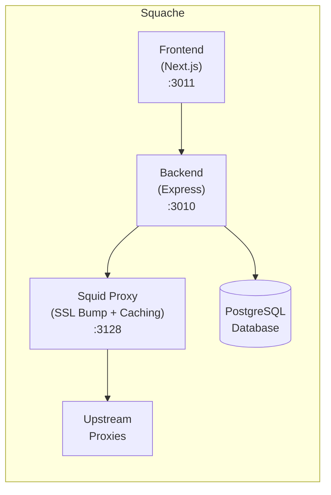

# Squache

> Intelligent caching proxy for web scraping with SSL bumping, upstream proxy routing, and a web-based management interface.

[](LICENSE)

## Overview

Squache (Squid + Cache) dramatically reduces bandwidth usage for web scraping operations by caching HTTPS traffic using SSL bumping. It supports routing through VPN or residential proxies and provides real-time analytics through a web dashboard.



## Features

- **SSL Bumping** – Intercepts and caches HTTPS traffic using a self-signed CA
- **Aggressive Caching** – Caches images, video, JS, CSS, and fonts
- **Upstream Proxy Routing** – Route through VPN or residential proxies with geographic selection
- **Web Dashboard** – Real-time bandwidth metrics, cache statistics, and log viewer
- **Configurable Rules** – Define caching rules per domain or content type

## Quick Start

### 1. Clone and Configure

```bash
git clone https://github.com/yourorg/squache.git
cd squache

# Copy example environment files
cp backend.env.example backend.env
cp frontend.env.example frontend.env

# Edit with your settings
nano backend.env
```

### 2. Generate SSL Certificate

The proxy requires a CA certificate for SSL bumping. Generate it once:

```bash
./scripts/generate-ssl-cert.sh
```

This creates certificates in `data/squache/ssl/`.

### 3. Start Services

```bash
docker compose up -d
```

Access the dashboard at http://localhost:3011

## Configuration

### Backend (`backend.env`)

| Variable | Description |
|----------|-------------|
| `DATABASE_URL` | PostgreSQL connection string |
| `JWT_SECRET` | Secret for JWT token signing |
| `ADMIN_EMAIL` | Admin account email (created on first run) |
| `ADMIN_PASS` | Admin account password |
| `UPSTREAM_PROXIES` | JSON array of upstream proxy configs |

### Frontend (`frontend.env`)

| Variable | Description |
|----------|-------------|
| `NEXT_PUBLIC_API_URL` | Backend API URL (browser-accessible) |
| `API_URL_INTERNAL` | Backend URL for SSR (Docker network) |

See `backend.env.example` and `frontend.env.example` for all options.

## Usage

### With Puppeteer

```typescript
import puppeteer from 'puppeteer';

const browser = await puppeteer.launch({
  args: [
    '--proxy-server=http://localhost:3128',
    '--ignore-certificate-errors',
  ],
});

const page = await browser.newPage();

// Optional: Route through specific upstream proxy
await page.setExtraHTTPHeaders({
  'X-Squache-Upstream': 'residential',
  'X-Squache-Country': 'US',
});

await page.goto('https://example.com');
```

### Upstream Proxy Headers

| Header | Values | Description |
|--------|--------|-------------|
| `X-Squache-Upstream` | `direct`, `vpn`, `residential` | Proxy type |
| `X-Squache-Country` | ISO code | Target country |
| `X-Squache-City` | City name | Target city |
| `X-Squache-Provider` | Provider name | Specific provider |

## API Endpoints

### Statistics
- `GET /api/stats` – Overall cache statistics
- `GET /api/stats/bandwidth` – Bandwidth over time
- `GET /api/stats/domains` – Per-domain stats

### Cache
- `GET /api/cache` – List cached objects
- `DELETE /api/cache` – Purge all
- `DELETE /api/cache/:pattern` – Purge by pattern

### Logs
- `GET /api/logs` – Recent access logs
- `GET /api/logs/search` – Search logs

### Configuration
- `GET /api/config` – Current config
- `PUT /api/config` – Update config
- `GET /api/upstreams` – List upstream proxies
- `POST /api/upstreams` – Add upstream proxy
- `DELETE /api/upstreams/:id` – Remove upstream

## Docker Services

| Service | Port | Description |
|---------|------|-------------|
| `squache-proxy` | 3128 | Squid caching proxy |
| `squache-backend` | 3010 | Express API server |
| `squache-frontend` | 3011 | Next.js dashboard |

## Bandwidth Savings

Typical savings for web scraping workloads:

- **Static assets**: 90%+ cache hit rate
- **Repeated crawls**: Dramatically reduced bandwidth
- **Residential proxies**: Minimize expensive metered connections

## SSL Certificate Trust

For production use, install the generated CA certificate in your system trust store instead of using `--ignore-certificate-errors`:

```bash
# Linux
sudo cp data/squache/ssl/squid-ca.crt /usr/local/share/ca-certificates/squache.crt
sudo update-ca-certificates

# macOS
sudo security add-trusted-cert -d -r trustRoot -k /Library/Keychains/System.keychain data/squache/ssl/squid-ca.crt
```

For Node.js applications:

```bash
export NODE_EXTRA_CA_CERTS=/path/to/squid-ca.crt
```

## Development

```bash
# Start services
docker compose up -d

# View proxy logs
docker compose logs -f squache-proxy

# Rebuild after changes
docker compose up -d --build
```

## License

MIT License - see [LICENSE](LICENSE) for details.
