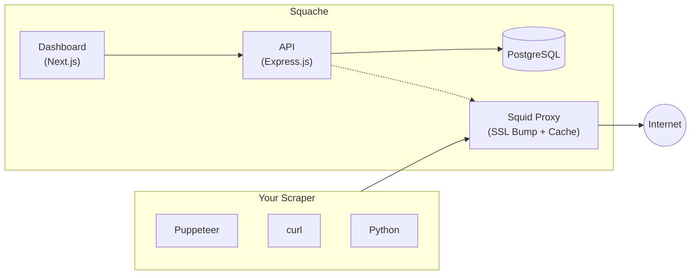

# Squache

> Cache HTTPS traffic for web scraping. Cut bandwidth costs by 90%.

[](LICENSE)
[](#changelog)

<video src="https://github.com/user-attachments/assets/082315ea-a766-4b07-8842-8202f17318ff" controls autoplay muted>Video not supported</video>

## Why Squache?

If you're running Puppeteer, Playwright, or any web scraper, you're downloading
the same JavaScript bundles, fonts, and images over and over again. Squache
intercepts HTTPS traffic and caches everything
aggressively reducing bandwidth by 90%+ for repeated crawls.

**Use cases:**
- Running hundreds of Puppeteer instances
- Scraping the same domains repeatedly
- Minimizing expensive residential proxy usage
- Building reproducible scrapers (same cached assets)

## Quick Start

```bash
git clone https://github.com/devrupt-io/squache.git
cd squache
docker compose up -d
```

That's it. No configuration required. SSL certificates are generated automatically.

- **Dashboard:** http://localhost:3011
- **Proxy:** http://localhost:3128

**First-time login:** Check the logs for your auto-generated admin password:

```bash
docker compose logs backend | grep -A5 "SQUACHE ADMIN"
```

Or set your own password:

```bash
ADMIN_PASS=your-password docker compose up -d
```

### Install the CA Certificate

Squache uses SSL bumping to cache HTTPS traffic. Download and install the CA certificate:

```bash
# Download the CA certificate
curl -o squache-ca.crt http://localhost:3010/api/config/ssl/certificate

# Linux
sudo cp squache-ca.crt /usr/local/share/ca-certificates/
sudo update-ca-certificates

# macOS
sudo security add-trusted-cert -d -r trustRoot -k /Library/Keychains/System.keychain squache-ca.crt

# Node.js (or add to your shell profile)
export NODE_EXTRA_CA_CERTS=$(pwd)/squache-ca.crt
```

### Use with Puppeteer

```typescript
import puppeteer from 'puppeteer';

const browser = await puppeteer.launch({
  args: ['--proxy-server=http://localhost:3128'],
});

await browser.newPage().then(page => page.goto('https://example.com'));
```

### Use with any HTTP client

```bash
# curl (after installing CA cert)
curl -x http://localhost:3128 https://example.com

# wget
https_proxy=http://localhost:3128 wget https://example.com

# Node.js / Python
export HTTPS_PROXY=http://localhost:3128
```

## How It Works



**Key features:**
- **SSL Bumping** - Decrypts HTTPS to cache responses (generates certs on-the-fly)
- **Aggressive Caching** - Forces caching of JS, CSS, images, fonts, and media
- **Web Dashboard** - Real-time bandwidth metrics and cache hit rates
- **Zero Config** - SSL certificates auto-generated on first run

## Dashboard

The dashboard shows real-time statistics:
- Bandwidth saved vs. bandwidth used
- Cache hit/miss ratios
- Per-domain statistics
- Request logs with search

Access at http://localhost:3011 after starting the services.

## Configuration

### Environment Variables

Create a `.env` file to customize:

```bash
# Admin credentials (password auto-generated if empty)
ADMIN_EMAIL=admin@example.com
ADMIN_PASS=your-secure-password  # Leave empty to auto-generate on each start

# Security (generate with: openssl rand -hex 32)
JWT_SECRET=your-random-secret

# If exposing to the internet
FRONTEND_URL=https://squache.yourdomain.com
BACKEND_URL=https://api.squache.yourdomain.com
CORS_ORIGIN=https://squache.yourdomain.com
```

## API Reference

Most endpoints require authentication via Bearer token. Public endpoints are
marked below.

### Auth
| Method | Endpoint | Description |
|--------|----------|-------------|
| POST | `/api/auth/login` | Login, returns JWT |
| GET | `/api/auth/me` | Current user info |

### Stats
| Method | Endpoint | Description |
|--------|----------|-------------|
| GET | `/api/stats` | Overall statistics |
| GET | `/api/stats/bandwidth?range=1h` | Bandwidth over time |
| GET | `/api/stats/domains` | Per-domain breakdown |

### Cache
| Method | Endpoint | Description |
|--------|----------|-------------|
| GET | `/api/cache` | Cache size and object count |
| DELETE | `/api/cache` | Purge all cache (admin) |

### Logs
| Method | Endpoint | Description |
|--------|----------|-------------|
| GET | `/api/logs` | Recent access logs |
| GET | `/api/logs/search?url=...` | Search logs |

### SSL (Public)
| Method | Endpoint | Description |
|--------|----------|-------------|
| GET | `/api/config/ssl/certificate` | Download CA cert (no auth) |

### Upstream Proxies (v0.2.0)
| Method | Endpoint | Description |
|--------|----------|-------------|
| GET | `/api/upstreams` | List upstream proxies |
| POST | `/api/upstreams` | Add upstream proxy |
| GET | `/api/upstreams/providers` | List known providers |

### Health (Public)
| Method | Endpoint | Description |
|--------|----------|-------------|
| GET | `/health` | Service health (no auth) |

## Ports

| Service | Port | Description |
|---------|------|-------------|
| Proxy | 3128 | Point scrapers here |
| Backend | 3010 | REST API |
| Frontend | 3011 | Web dashboard |

## Bandwidth Savings

Typical savings for web scraping workloads:

| Content Type | Cache Hit Rate |
|-------------|----------------|
| JavaScript/CSS | 95%+ |
| Images/Fonts | 90%+ |
| Video/Media | 85%+ |
| Repeated crawls | 90%+ overall |

## Development

```bash
# Clone
git clone https://github.com/devrupt-io/squache.git
cd squache

# Start in development mode
docker compose up -d

# Watch logs
docker compose logs -f

# Rebuild after changes
docker compose up -d --build
```

## Roadmap

### v0.2.0 - Upstream Proxy Routing

Route requests through VPN or residential proxies based on HTTP headers:

```typescript
await page.setExtraHTTPHeaders({
  'X-Squache-Upstream': 'residential',  // vpn | residential | direct
  'X-Squache-Country': 'US',            // ISO country code
});
```

- [ ] Wire up Squid ACLs for header-based routing
- [ ] Provider integrations (Webshare, Bright Data, Oxylabs)
- [ ] Load balancing across multiple upstream proxies
- [ ] Automatic failover

> **Note:** The infrastructure exists (database models, API endpoints, config
> generation in
> [backend/src/routes/upstreams.ts](backend/src/routes/upstreams.ts)), but Squid
> routing rules are not yet fully wired up.

## Architecture

```
squache/
├── proxy/              # Squid configuration
│   ├── squid.conf      # Main config
│   ├── entrypoint.sh   # Auto-init SSL db
│   └── conf.d/         # Dynamic config (managed by backend)
├── backend/            # Express.js API
│   └── src/
│       ├── routes/     # REST endpoints
│       ├── services/   # Squid config generator
│       └── models/     # Sequelize models
├── frontend/           # Next.js dashboard
└── docker-compose.yml  # Self-contained setup
```

## Changelog

### v0.1.0 (2024-12-18)

Initial release.

- SSL bumping with auto-generated CA certificates
- Aggressive caching for static assets (JS, CSS, images, fonts, video)
- Web dashboard with real-time metrics
- PostgreSQL for statistics and configuration
- Docker Compose for easy self-hosting
- REST API for programmatic access

## Contributing

Pull requests welcome. For major changes, please open an issue first.

## Powered By

Squache is built on the shoulders of giants:

- **[Squid Cache](http://www.squid-cache.org/)** - The battle-tested caching
  proxy that powers Squache. 25+ years of development, used by ISPs and
  enterprises worldwide. All the SSL bumping, caching algorithms, and proxy
  magic comes from Squid.
- **[Next.js](https://nextjs.org/)** - React framework powering the dashboard
- **[Express.js](https://expressjs.com/)** - Fast, unopinionated API server
- **[Sequelize](https://sequelize.org/)** - TypeScript ORM for PostgreSQL
- **[PostgreSQL](https://www.postgresql.org/)** - Rock-solid database
- **[Docker](https://www.docker.com/)** - Containerization for easy deployment

## License

MIT License - see [LICENSE](LICENSE) for details.

---

Built by [devrupt.io](https://devrupt.io) - We build practical tools for
everyone.


